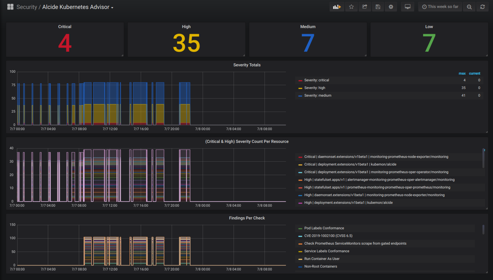

## Alcide Kubernetes Advisor | Prometheus + Grafana

Alcide Kubernetes Advisor, when deployed into the cluster, performs periodic scans. The latest scan summary can be consumed as grafana dashboard that use prometheus as its datasource.



## Create Free Account

To test the full blown capabilities of **Alcide Kubernetes Advisor** claim your 'Free Forever' account [here](https://www.alcide.io/advisor-free-trial/)

## Installation

`alcide-servicemonitor.yaml` contains 2 resources:  `Service` of type `ClusterIp` and Prometheus Operator `ServiceMonitor`.The installed service acts as the scraping endpoint for prometheus Service Monitors.

Note that `alcide-servicemonitor.yaml` was tested with the default Prometheus Operator installation (`monitoring` namespace). If you deployed into a different namespace, make sure to make the necessary edits.

```yaml
---
#
# Internal Service to scrape metrics from Alcide Advisor
#
apiVersion: v1
kind: Service
metadata:
  name: kubemon-metrics
  namespace: alcide
  labels:
    name: kubemon-metrics
    tier: monitor
    metrics: kubemon
spec:
  type: ClusterIP
  selector:
    app: kubemon
  ports:
    - name: metrics
      port: 6666
      targetPort: 6666
      protocol: TCP
---

#
# The Service Monitor 
#
apiVersion: monitoring.coreos.com/v1
kind: ServiceMonitor
metadata:
  labels:
    app: kubemon
    release: monitoring
  name: kubemon
  namespace: monitoring #Modify to match the namespace you installed your Prometheus Operator
spec:
  endpoints:
    - interval: 30s #Modify to match your scan schedule
      path: /metrics
      port: metrics
  namespaceSelector:
    matchNames:
      - alcide
  selector:
    matchLabels:
      app: kubemon
```

To install run:

```bash 
kubectl apply -f alcide-servicemonitor.yaml
```

Install **Alcide Kubernetes Advisor** Grafana dashboard

- Login into your Grafana and add the dashboard `alcide-advisor-grafana.json`

## Troubleshooting

If you run into issues with Prometheus Operator see the [Service Monitor troubleshooting section](https://github.com/coreos/prometheus-operator/blob/master/Documentation/troubleshooting.md#overview-of-servicemonitor-tagging-and-related-elements)


